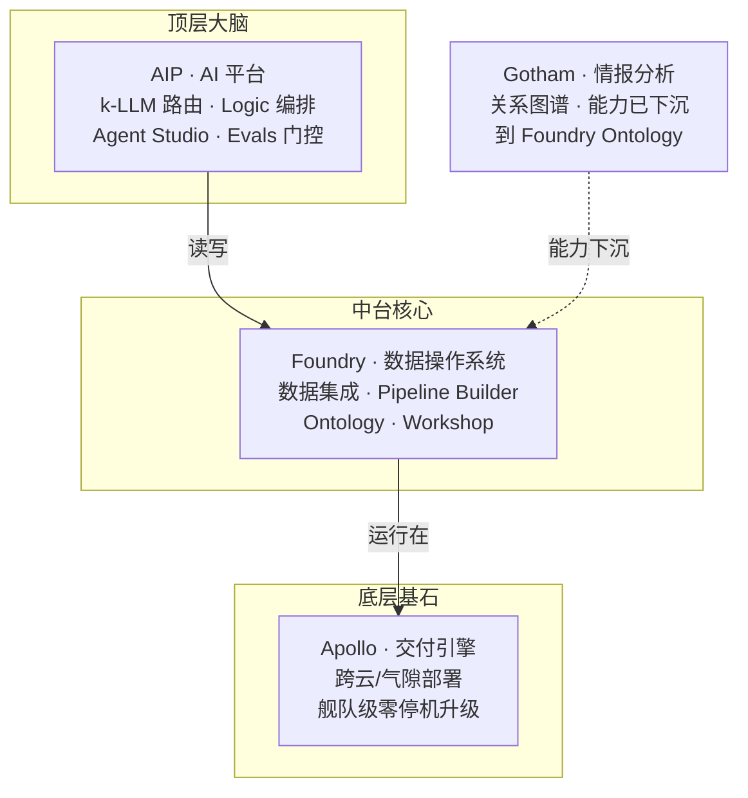
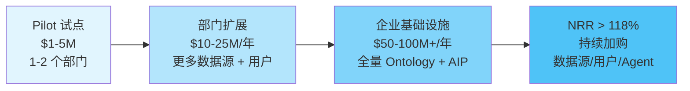
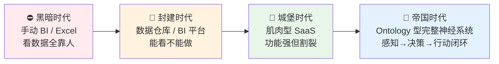

# 为什么企业AI需要操作系统：从数据到行动

> 你公司买了 GPT-4 的 API，接了内部知识库，做了个对话机器人——然后呢？

2025 年，一家叫 Palantir 的公司全年收入 **44.75 亿美元**，同比增长 56%。它的市值在 5 年内增长了 **25 倍**，从 150 亿美元飙到 3750 亿美元。Forrester 把它评为 AI/ML 平台领导者，Dresner 在 Agentic AI、AI DS ML、ModelOps 三个维度都给了它第一名。

它不是做大模型的。它不是卖 GPU 的。它不是做云的。

它做的事情，用一句话概括：**为企业 AI 打造一个操作系统。**

这篇文章要回答一个问题：**为什么企业 AI 需要一个操作系统，而不是更多的模型？**

---

## 一、一个残酷的事实：大模型在企业里"落不了地"

让我们先承认一个行业共识：**LLM 很强，但在企业里很难用。**

不是模型不够聪明，而是模型和企业现实之间存在巨大的鸿沟。举个真实场景：

> 一家制造业客户，内部有 12 套 ERP 系统、8 个工厂 MES、200+ Excel 报表。CIO 买了一年的 GPT-4 API，找了个团队做了个"智能助手"。三个月后，业务部门的反馈是：
>
> - "它说的数字和实际库存对不上。"
> - "它推荐的操作，我们不能执行，因为权限不对。"
> - "它分析的问题，我们上周已经解决了，但它不知道。"
> - "它偶尔会编造一个不存在的客户编号。"

这不是 GPT-4 的错。模型本身就是概率推理引擎——给它 prompt，它返回最可能的下一个 token。但企业场景需要的不是"最可能的回答"，而是**"正确的、可执行的、有权限边界的、可审计的决策"**。

这中间差的，不是更好的模型，而是一整套**让模型安全地接入企业现实世界的中间层**。

这就是 Palantir 看到的机会。

---

## 二、Palantir 的答案：不是更好的模型，而是 AI 的操作系统

Palantir 的核心洞察可以浓缩成一个公式：

```
真正可用的企业 AI = Ontology（语义层） × LLM（推理引擎） × Actions（执行闭环）
```

这三个要素缺一不可：

| 要素 | 作用 | 没有它会怎样 |
|------|------|------------|
| **Ontology（本体语义层）** | 让 AI 理解"什么是客户、什么是订单、什么是库存" | LLM 把数据当纯文本处理，幻觉频发 |
| **LLM（大语言模型）** | 提供推理、理解、生成能力 | 只有规则引擎，无法处理模糊和开放问题 |
| **Actions（行动机制）** | 让 AI 的建议能安全地变成真实的业务操作 | AI 只能"说"不能"做"，价值停留在纸面 |

而把这个公式变成产品，就是 Palantir 的**四大平台**：



> 来源：Palantir 全链路总览，基于官方文档整理

### Apollo——让系统在任何环境活着

Apollo 是最底层的基石。它的任务是：**让 Foundry 和 AIP 这套包含 300+ 微服务的复杂系统，在全球任何环境稳定运行——包括气隙环境（air-gapped，完全没有互联网连接）。**

Apollo 不是 Jenkins。Jenkins 管的是 CI/CD pipeline；Apollo 管的是**跨云、私有云、气隙边缘环境的舰队级部署和持续交付**。它用约束求解（constraint solving）自动生成部署计划，让 300+ 微服务的版本升级在零停机下完成。

> 为什么独立成层？因为每个客户环境都不一样——有的在 AWS，有的在私有云，有的在完全断网的军事基地。一个统一的交付引擎是规模化交付的前提。

### Foundry——让数据变成可执行的业务世界

Foundry 是 Palantir 的营收核心。它的使命：**把企业散落在几百个系统里的数据，编译成一个统一的、有业务语义的、可执行的世界模型。**

这分三步：

1. **数据集成（Pipeline Builder）**：200+ Connector 把 Excel、PDF、ERP、IoT、日志等异构数据源接入，清洗、转换、编排，落到不可变的 Backing Dataset 层。
2. **Ontology 映射**：把底层表（Table）映射成现实世界的对象（Object）——客户、订单、工厂、SKU。每个对象有属性（Property）、关系（Link）、动作（Action）。
3. **应用构建（Workshop）**：基于 Ontology 对象搭建业务应用，前端展示"对象卡片"而不是"数据表格"。

关键在于**第 2 步——Ontology**。这是 Palantir 和所有数据湖产品的本质区别。

### AIP——让 AI 在本体世界里安全行动

AIP（AI Platform）是 2023 年推出的增长引擎。它不是一个"LLM 调用网关"，而是一套让 AI 安全接入企业运营的完整框架：

- **k-LLM 路由**：按任务敏感度、复杂度自动路由到合适的模型。敏感数据走私有模型，通用问题走 GPT-4，成本和能力实时平衡。
- **AIP Logic**：Block 链式编排引擎。LLM **只负责提议**（propose），系统**确定性执行**（execute）Action。人可以介入审批（HITL）。
- **AIP Chatbot Studio**（原 Agent Studio）：低代码构建企业专属 AI Agent。每个 Agent 有明确的 World Definition——它是 Ontology 的一个子集 + 工具白名单，不能越界操作。
- **AIP Evals**：质量门控。非确定性的 LLM 输出必须通过评测集和回归测试才能进入生产环境。

### Gotham——情报分析能力下沉

Gotham 原本是面向政府/军方的情报分析平台，但它的核心能力——**关系网络分析（Link Analysis）+ 地理空间分析**——已经下沉到 Foundry Ontology + Workshop 图谱中。企业客户不需要单独买 Gotham，直接在 Ontology 里建"实体-关系"对象，用 Workshop 做调查台即可。

---

## 三、为什么是"操作系统"而不是"平台"？

到这里你可能会问：这不就是一个数据平台 + AI 平台吗？为什么要叫"操作系统"？

因为操作系统的本质，不是"管理硬件"，而是**提供一组统一的抽象**，让上层应用不需要关心下层差异。

| 层次 | 个人电脑 OS | Palantir 企业 AI OS |
|------|-----------|-------------------|
| **底层资源** | CPU/内存/磁盘 | 200+ 异构数据源/云环境/模型 |
| **抽象层** | 文件系统/进程/权限 | Ontology（Object/Action/Link/Property） |
| **开发框架** | Win32/POSIX API | Workshop/AIP Logic/OSDK |
| **运行时** | 进程调度器 | k-LLM 路由 + Apollo 交付引擎 |
| **权限模型** | 用户/组/ACL | Markings/RBAC/行列权限 + Ontology 级别 |
| **安全边界** | 沙箱 | World Definition + HITL + Evals 门控 |

**没有操作系统的世界是什么样的？** 每个应用都要自己处理"数据怎么读、格式怎么转、权限怎么判、模型怎么调"——结果就是 100 个项目 100 套基础设施，重复造轮子，永远无法规模化。

**有操作系统的世界是什么样的？** 所有应用共享同一套 Ontology、同一套权限模型、同一套交付管线。AI Agent 不需要直连数据库——它通过 Action 接口操作 Ontology 对象，权限在运行时原子裁决。

> 这正是 Palantir 官方文档的原话："Together with Foundry and Apollo, AIP forms an **operating system** that can deliver a full range of AI-driven products."
>
> 来源：[Palantir AIP Overview](https://www.palantir.com/docs/foundry/aip/overview/)

---

## 四、商业验证：凭什么值千亿？

理论再好，市场不买单也没用。Palantir 的数字很硬：

| 指标 | 数据 | 含义 |
|------|------|------|
| **2025 年收入** | $44.75 亿（YoY +56%） | 不是融资烧钱，是真金白银的收入 |
| **毛利率** | 82% | 软件级毛利率，不是人力外包 |
| **Top 20 客户均收入** | $9390 万（YoY +45%） | 大客户越用越深，不是一锤子买卖 |
| **Rule of 40** | 127% | 收入增速 + 利润率远超 40% 安全线 |
| **客户留存率** | 98% | 几乎没有客户流失 |
| **净扩展率（NRR）** | 124% | 老客户每年加购 24% | 
| **Q4 美国商业收入增速** | 首次超过政府收入（+137%） | 从政府军工扩展到主流企业市场 |

这些数字背后是一个商业模式：**Land-and-Expand（登陆然后扩张）**。



**Palantir 卖的不是席位，是"决策能力" + 极高切换成本。** 一旦企业的核心业务对象都建在 Ontology 里，几十个 AI Agent 都跑在 AIP 上，你很难把它换掉——因为 Ontology 已经成了企业业务逻辑的事实标准（de facto standard）。

这就是护城河的本质：**不是技术壁垒，而是组织知识的不可迁移性。**

---

## 五、类比：从帝国时代看企业 AI 的演进

如果把企业 AI 的发展比作 RTS 游戏里的时代演进：



- **黑暗时代**：数据散落在 Excel 和各个系统里，看数据全靠人肉拉表。
- **封建时代**：有了数据仓库和 BI 平台，能做报表了，但**只能看不能做**——看到问题后，还是得人去 ERP 里手动操作。
- **城堡时代**：买了一堆 SaaS——CRM、ERP、SCM、BI——每个功能都很强，但**彼此割裂**，数据对不上，流程连不起。
- **帝国时代**：Palantir 把它叫"**Ontology 型完整神经系统**"。不是一个工具，而是一套让数据→理解→决策→行动闭环的**神经系统**：
  - **LLM 是大脑**：负责理解和推理
  - **Ontology 是中枢神经**：传递语义和上下文
  - **MCP/Actions 是双手**：执行真实操作
  - **Apollo 是骨骼**：支撑系统在全球任何环境稳定运行

**肌肉型 SaaS**（城堡时代）就像一个强壮但没有神经系统的生物——力量很大，但反应迟钝，各部分不协调。**Ontology 型神经系统**（帝国时代）让企业的每一个数据变化都能被即时感知、理解、并触发正确的行动。

这就是 Palantir 的终极愿景，也是它值千亿的理由。

---

## 六、对你意味着什么？

如果你是一个**技术决策者**（CTO / 架构师），这篇文章想传递的核心信息是：

1. **不要只买模型，要建中间层。** 大模型会越来越便宜、越来越强，但企业 AI 的瓶颈不在模型，而在模型和企业现实之间的那一层——Ontology、Action、权限、审计。

2. **Ontology 不是知识图谱。** 知识图谱是静态的；Ontology 是**运行时**的——每个 Object 有 Action，每个 Action 有权限，每个操作有审计。它是活的业务世界。

3. **AI 必须能"做"，不只是能"说"。** 只有当 AI 的建议能安全地变成真实的业务操作（写入系统、触发流程、通知人员），AI 的价值才从"辅助"升级为"运营"。

4. **安全不是补丁，是架构。** Palantir 的安全不是事后加的过滤器——World Definition 从设计阶段就限定了 Agent 能看到什么、能做什么。HITL（Human-in-the-loop）让高风险操作必须经人审批。Evals 门控让非确定性输出必须通过测试才能上线。

5. **交付能力是隐藏的竞争力。** Apollo 的存在意味着 Palantir 能部署到任何环境——包括中国企业的私有云、金融行业的气隙网络、制造业的边缘节点。这是纯 SaaS 做不到的。

---

## 七、这个系列要讲什么

这篇文章是 AOS 系列的**第 01 篇**，回答的是"**为什么**"。

接下来的 8 篇，我们会逐层深入：

| 批次 | 编号 | 标题 | 回答的问题 |
|------|------|------|-----------|
| **第一批** | 02 | 企业 AI 落地的 5 道墙 | 具体痛在哪里？ |
| **第二批** | 03 | Ontology 本体论 | 语义层怎么设计？ |
| | 04 | 数据集成与 Pipeline | 杂乱数据怎么编译成可信资产？ |
| **第三批** | 05 | AIP 决策引擎 | AI 怎么安全地行动？ |
| | 06 | Workshop 低代码平台 | 应用怎么构建？ |
| **第四批** | 07 | Apollo 持续交付 | 怎么部署到任何环境？ |
| | 08 | 系统架构与工程组织 | 3400+ 模块怎么不乱？ |
| | 09 | 技术实现方案 | 714 项任务怎么落地？ |

**篇 02** 我们会把 5 道墙（数据孤岛、语义割裂、幻觉失控、行动无能、部署困境）逐个拆透——不讲方案，只定义问题。让你痛完之后，篇 03 开始逐一击破。

---

## 附录：关键数据来源

| 数据点 | 来源 |
|--------|------|
| 2025 年收入 $44.75 亿 | Palantir 2025 年报 |
| Rule of 40 = 127% | 同上 |
| 留存率 98% / NRR 124% | 同上 |
| Top 20 客户均收入 $9390 万 | 同上 |
| AIP = Operating System 表述 | [Palantir AIP Overview 官方文档](https://www.palantir.com/docs/foundry/aip/overview/) |
| Forrester Wave Leader | Forrester Q3 2024 |
| Dresner 三个 No.1 | Dresner 2025 |
| 300+ 微服务 / Apollo 部署 | Palantir Apollo 官方文档 |
| AIP Agent Studio → Chatbot Studio | 2026-04-27 更名公告 |

> **声明**：本文所有 Palantir 产品描述基于 Palantir 官方公开文档和财报数据。截图来自 Palantir Foundry 官方文档。本文为独立技术分析，不代表 Palantir 官方立场。

---

*下一篇：[企业 AI 落地的 5 道墙](02-five-walls.md)*
